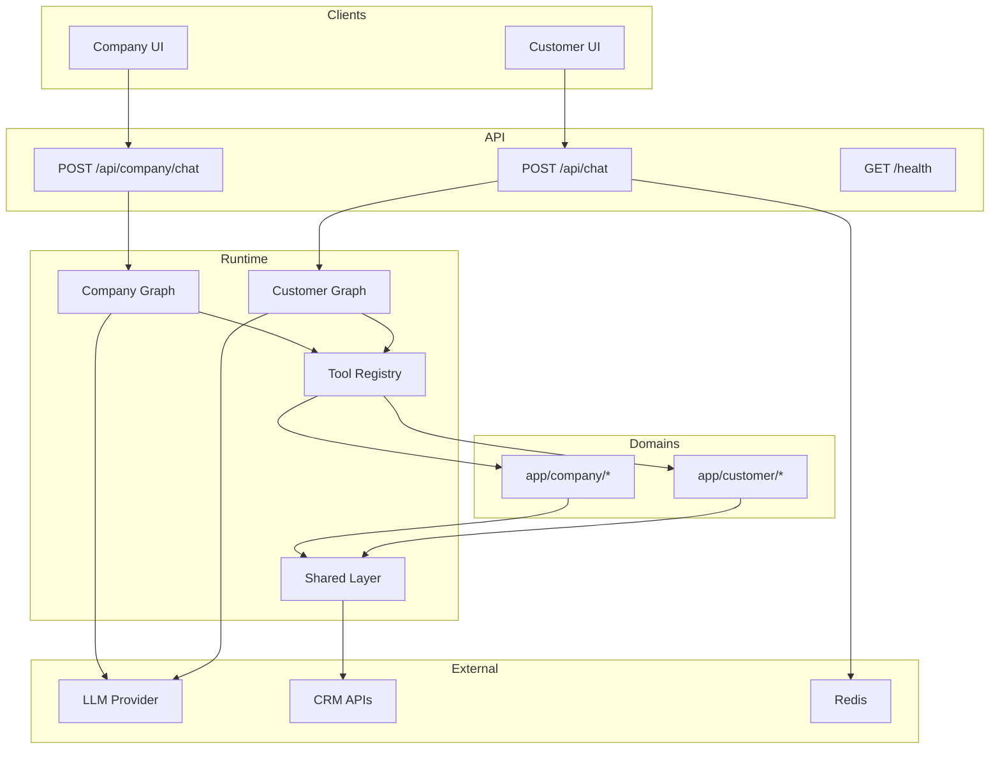
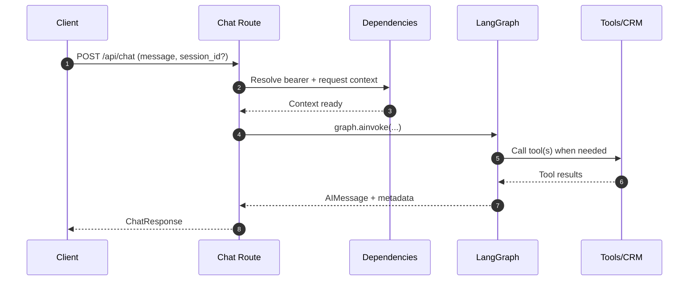

# Wasla AI Agent Backend

FastAPI backend for Wasla conversational workflows, powered by LangGraph + LangChain tool orchestration.

---

## Quick Start

### 1) Install dependencies

```bash
cd wasla-models
python -m venv .venv

# Windows
.venv\Scripts\activate
# Linux / macOS
source .venv/bin/activate

pip install -r requirements.txt
```

### 2) Configure environment

```bash
cp .env.example .env
```

Set at minimum:
- `LLM_PROVIDER` (`ollama`, `openrouter`, or `anthropic`)
- `MAIN_CHAT_MODEL`
- `FALLBACK_CHAT_MODEL`
- `LLM_API_KEY` (required for cloud providers, not required for Ollama)

### 3) Run API

```bash
uvicorn app.main:app --reload --host 0.0.0.0 --port 8000
```

- Swagger: <http://localhost:8000/docs>
- ReDoc: <http://localhost:8000/redoc>
- OpenAPI JSON: <http://localhost:8000/openapi.json>

---

## API Surface

| Method | Path | Purpose |
|---|---|---|
| `POST` | `/api/chat` | Customer-facing conversational assistant |
| `POST` | `/api/company/chat` | Company/staff-facing conversational assistant |
| `GET` | `/health` | Service liveness and active LLM configuration |

### Chat contract

`POST /api/chat` and `POST /api/company/chat` both use:

- Request: `message`, optional `session_id`
- Response: `response`, `session_id`, `tool_calls_made`, `model_used`, `charts`

---

## Documentation

### Backend (new)

- [`docs/backend-architecture-guide.md`](docs/backend-architecture-guide.md) — architecture overview, core techniques, and Mermaid diagrams.
- [`docs/backend-api-guide.md`](docs/backend-api-guide.md) — auth/session behavior, endpoint contracts, examples, and error handling.

### Frontend integration guides

- [`docs/frontend-customer-guide.md`](docs/frontend-customer-guide.md)
- [`docs/frontend-company-guide.md`](docs/frontend-company-guide.md)
- [`docs/frontend-migration-guide.md`](docs/frontend-migration-guide.md)

### Project planning artifacts

- Design spec: [`docs/superpowers/specs/2026-04-14-backend-professional-docs-design.md`](docs/superpowers/specs/2026-04-14-backend-professional-docs-design.md)
- Implementation plan: [`docs/superpowers/plans/2026-04-14-backend-professional-docs.md`](docs/superpowers/plans/2026-04-14-backend-professional-docs.md)

---

## Architecture (Current)

Top-level backend modules:

- `app/main.py` — FastAPI app bootstrap, OpenAPI metadata, lifespan init
- `app/api/` — request models/dependencies and route handlers
- `app/customer/` — customer-domain tools/operations/client
- `app/company/` — company-domain tools/operations/client
- `app/shared/` — shared agent, auth, LLM, HTTP, state utilities
- `app/prompts/` — prompt assets for customer/company agents

### Component diagram



### Request lifecycle (`POST /api/chat`)



For deeper diagrams and design notes, see `docs/backend-architecture-guide.md`.

---

## Environment Variables (Core)

| Variable | Description |
|---|---|
| `LLM_PROVIDER` | LLM backend selector (`ollama`, `openrouter`, `anthropic`) |
| `LLM_API_KEY` | API key for cloud providers |
| `LLM_BASE_URL` | OpenAI-compatible base URL for provider |
| `OLLAMA_BASE_URL` | Ollama base URL when using local inference |
| `MAIN_CHAT_MODEL` | Primary chat model |
| `FALLBACK_CHAT_MODEL` | Fallback model |
| `MAX_CONTEXT_TOKENS` | Token budget for context management |
| `CRM_API_BASE_URL` | Customer CRM API base URL |
| `COMPANY_API_BASE_URL` | Company CRM API base URL |
| `REDIS_URL` | Redis connection for rate limiting |

For the full config reference, use `.env.example` and `app/core/config.py`.
