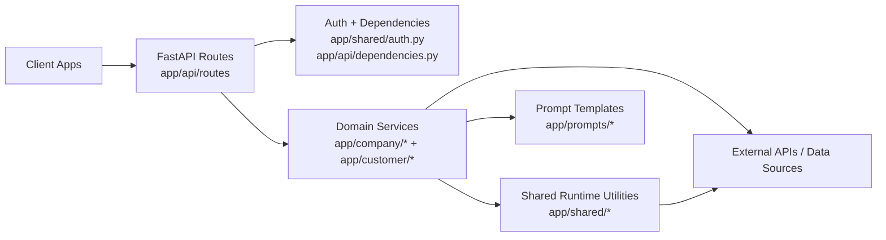
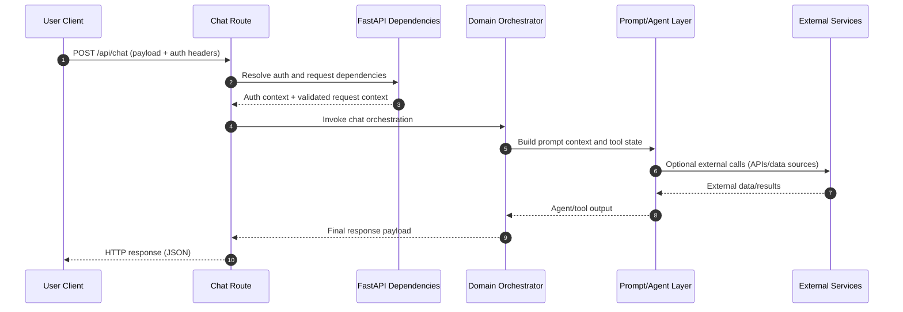

# Backend Architecture Guide

This guide explains how the backend is organized and how requests flow through the system. It is written for a mixed audience: developers who need implementation detail and technical stakeholders who need a clear operational model.

## System Overview

The backend is a FastAPI service designed around domain-focused modules and shared infrastructure. The current structure separates company-facing and customer-facing capabilities while reusing common foundations for auth, HTTP client behavior, prompts, and agent state handling.

At a high level:

- `app/main.py` boots the FastAPI application and wires the route modules.
- `app/api/routes/` exposes HTTP endpoints such as chat routes.
- `app/company/` and `app/customer/` implement domain-specific business and tool orchestration.
- `app/shared/` contains reusable primitives (auth helpers, LLM/agent helpers, HTTP client wrappers, shared state/models).
- `app/prompts/` stores system prompts and behavior scaffolding.

## Core Techniques Used

The backend uses several practical techniques to keep behavior reliable and maintainable in production:

1. **Dependency-injected route composition**
   - FastAPI dependencies centralize auth and request context setup.
   - Routes stay lightweight while orchestration lives in domain modules.

2. **Domain partitioning with shared infrastructure**
   - Company and customer logic are split into dedicated packages.
   - Shared modules reduce duplication for cross-cutting concerns (HTTP calls, auth, state, prompts).

3. **Prompt-driven behavior with explicit prompt assets**
   - Prompt files in `app/prompts/` make agent behavior versionable and reviewable.
   - Prompt updates can be rolled out without reworking core route code.

4. **Resilient outbound I/O**
   - HTTP integrations are isolated in client wrappers.
   - Retry utilities help absorb transient external failures and improve request success rates.

5. **Structured schemas and shared state models**
   - Pydantic schemas and shared model definitions provide typed contracts.
   - Contract clarity improves API consistency and lowers integration regressions.

## Request Lifecycle (`POST /api/chat`)

This section documents the typical flow of a chat request from entry to response.

Typical implementation responsibilities in this lifecycle:

- **Route layer**: request parsing, dependency usage, response shaping.
- **Dependency layer**: authentication, authorization context, request-scoped metadata.
- **Domain orchestration layer**: decision-making and sequencing across tools/services.
- **Shared runtime layer**: retries, HTTP client behavior, schema/state consistency.

Response contract terminology should stay aligned with OpenAPI and API docs:

- `session_id`: conversation continuity identifier returned on each chat response and reused by clients for follow-up turns.
- `tool_calls_made`: integer count of tool invocations performed while serving the request.
- `model_used`: model identifier used to generate the final response content.

## Operational Notes

- Keep route modules thin; push business decisions into domain operations.
- Reuse shared HTTP and auth primitives to keep behavior consistent across domains.
- Treat prompt and schema files as first-class artifacts and review them in code review.
- Add targeted tests for docs and API contracts to keep implementation and documentation aligned.
