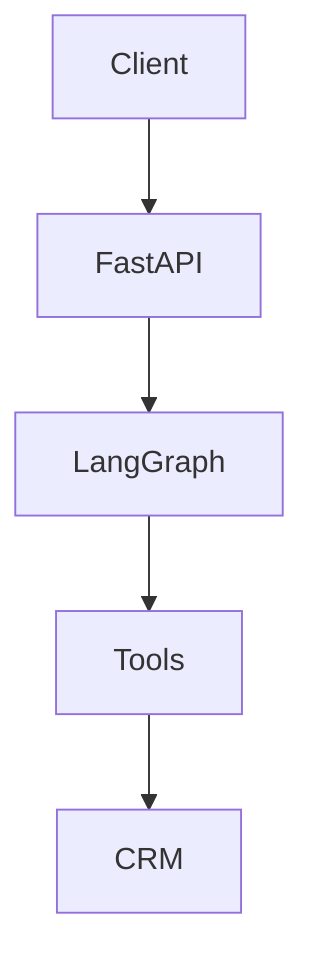

# Backend Professional Docs Implementation Plan

> **For agentic workers:** REQUIRED SUB-SKILL: Use superpowers:subagent-driven-development (recommended) or superpowers:executing-plans to implement this plan task-by-task. Steps use checkbox (`- [ ]`) syntax for tracking.

**Goal:** Deliver professional backend documentation (architecture + API guide with Mermaid diagrams) and upgrade FastAPI-generated docs so Swagger/ReDoc are descriptive and consistent for both internal engineers and API integrators.

**Architecture:** The implementation is documentation-first with a small code-metadata pass. We create two new backend docs (`architecture` + `api`), then refine OpenAPI metadata in `main.py`, route decorators/docstrings, and shared Pydantic schemas so generated docs align with written guides.

**Tech Stack:** Python 3.11+, FastAPI, Pydantic v2, LangGraph/LangChain backend, Markdown + Mermaid, pytest + FastAPI TestClient

---

## File Structure Lock-In

### Files to Create
- `docs/backend-architecture-guide.md` — backend module map, techniques, and Mermaid architecture/flow diagrams.
- `docs/backend-api-guide.md` — integrator-facing API usage guide (auth, sessions, endpoints, errors, examples).
- `tests/api/test_openapi_docs_quality.py` — regression tests for OpenAPI docs metadata quality.

### Files to Modify
- `app/main.py` — API title/summary/description/tag metadata polish.
- `app/api/routes/chat.py` — customer chat endpoint summary/description/responses polish.
- `app/api/routes/company_chat.py` — company chat endpoint summary/description/responses polish.
- `app/api/dependencies.py` — request/response field descriptions and examples wording improvements.

### Responsibility Boundaries
- Markdown files hold narrative documentation and diagrams.
- Python files hold OpenAPI metadata source-of-truth.
- Test file verifies generated OpenAPI includes required documentation quality signals.

---

### Task 1: Build the Backend Architecture Guide

**Files:**
- Create: `docs/backend-architecture-guide.md`
- Test: `tests/api/test_openapi_docs_quality.py` (indirectly validates language consistency later)

- [ ] **Step 1: Write the failing doc-content test (new test file skeleton)**

```python
from pathlib import Path


def test_backend_architecture_guide_exists_with_required_sections() -> None:
    path = Path("docs/backend-architecture-guide.md")
    assert path.exists(), "Architecture guide file must exist"
    content = path.read_text(encoding="utf-8")
    required_markers = [
        "# Backend Architecture Guide",
        "## System Overview",
        "## Core Techniques Used",
        "## Request Lifecycle (`POST /api/chat`)",
        "```mermaid",
    ]
    for marker in required_markers:
        assert marker in content, f"Missing section marker: {marker}"
```

- [ ] **Step 2: Run test to verify it fails**

Run: `pytest tests/api/test_openapi_docs_quality.py::test_backend_architecture_guide_exists_with_required_sections -v`  
Expected: FAIL because file/sections do not exist yet.

- [ ] **Step 3: Write minimal architecture guide content**

```markdown
# Backend Architecture Guide

## System Overview
- Purpose, audience, high-level component map.

## Core Techniques Used
- LangGraph orchestration
- Domain split (customer/company/shared)
- Retry + fallback strategy
- Auth extraction and request context propagation

## Request Lifecycle (`POST /api/chat`)
- Step-by-step flow from HTTP request to graph execution and response.

## Diagrams

```

- [ ] **Step 4: Expand to final architecture guide quality**

```markdown
## Diagram 1: Component Architecture
```mermaid
graph TB
  subgraph Clients
    C1[Customer UI]
    C2[Company UI]
  end
  subgraph API
    R1[/api/chat]
    R2[/api/company/chat]
    H[/health]
  end
  subgraph Agent Layer
    G1[Customer Graph]
    G2[Company Graph]
    T[Tool Registry]
  end
  subgraph Domain Layer
    D1[customer/*]
    D2[company/*]
    S[shared/*]
  end
  subgraph External
    CRM[CRM APIs]
    LLM[LLM Provider]
    REDIS[Redis]
  end
  C1 --> R1
  C2 --> R2
  R1 --> G1
  R2 --> G2
  G1 --> T
  G2 --> T
  T --> D1
  T --> D2
  D1 --> S
  D2 --> S
  S --> CRM
  G1 --> LLM
  G2 --> LLM
  R1 --> REDIS
```
```

- [ ] **Step 5: Run test to verify it passes**

Run: `pytest tests/api/test_openapi_docs_quality.py::test_backend_architecture_guide_exists_with_required_sections -v`  
Expected: PASS.

- [ ] **Step 6: Commit**

```bash
git add docs/backend-architecture-guide.md tests/api/test_openapi_docs_quality.py
git commit -m "docs: add backend architecture guide with Mermaid diagrams"
```

---

### Task 2: Build the Backend API Guide

**Files:**
- Create: `docs/backend-api-guide.md`
- Modify: `tests/api/test_openapi_docs_quality.py`

- [ ] **Step 1: Write the failing doc-content test for API guide**

```python
from pathlib import Path


def test_backend_api_guide_exists_with_required_sections() -> None:
    path = Path("docs/backend-api-guide.md")
    assert path.exists(), "Backend API guide file must exist"
    content = path.read_text(encoding="utf-8")
    required_markers = [
        "# Backend API Guide",
        "## Authentication",
        "## Session Continuity",
        "## Endpoints",
        "## Error Handling Matrix",
    ]
    for marker in required_markers:
        assert marker in content, f"Missing section marker: {marker}"
```

- [ ] **Step 2: Run test to verify it fails**

Run: `pytest tests/api/test_openapi_docs_quality.py::test_backend_api_guide_exists_with_required_sections -v`  
Expected: FAIL because file/sections do not exist yet.

- [ ] **Step 3: Write minimal API guide scaffold**

```markdown
# Backend API Guide

## Authentication
Bearer token usage and Swagger input guidance.

## Session Continuity
How `session_id` is created and reused.

## Endpoints
- `POST /api/chat`
- `POST /api/company/chat`
- `GET /health`

## Error Handling Matrix
Status code, meaning, and recommended client action.
```

- [ ] **Step 4: Expand to final API guide quality with concrete examples**

```markdown
## `POST /api/chat`
Request:
```json
{ "message": "Show trending companies", "session_id": null }
```
Response:
```json
{
  "response": "...",
  "session_id": "uuid",
  "tool_calls_made": 2,
  "model_used": "model-id",
  "charts": []
}
```
```

- [ ] **Step 5: Run test to verify it passes**

Run: `pytest tests/api/test_openapi_docs_quality.py::test_backend_api_guide_exists_with_required_sections -v`  
Expected: PASS.

- [ ] **Step 6: Commit**

```bash
git add docs/backend-api-guide.md tests/api/test_openapi_docs_quality.py
git commit -m "docs: add backend API guide for integrators"
```

---

### Task 3: Upgrade OpenAPI Metadata in FastAPI App and Routes

**Files:**
- Modify: `app/main.py`
- Modify: `app/api/routes/chat.py`
- Modify: `app/api/routes/company_chat.py`
- Modify: `app/api/dependencies.py`
- Modify: `tests/api/test_openapi_docs_quality.py`

- [ ] **Step 1: Write failing OpenAPI metadata regression tests**

```python
from fastapi.testclient import TestClient
from app.main import app


def test_openapi_has_professional_top_level_metadata() -> None:
    client = TestClient(app)
    schema = client.get("/openapi.json").json()
    assert "Agentic AI backend" in schema["info"]["summary"]
    assert "Customer Chat" in {t["name"] for t in schema["tags"]}
    assert "Company Chat" in {t["name"] for t in schema["tags"]}


def test_chat_routes_have_descriptive_docs() -> None:
    client = TestClient(app)
    schema = client.get("/openapi.json").json()
    customer_post = schema["paths"]["/api/chat"]["post"]
    company_post = schema["paths"]["/api/company/chat"]["post"]
    assert customer_post.get("summary")
    assert customer_post.get("description")
    assert "503" in customer_post.get("responses", {})
    assert company_post.get("summary")
    assert company_post.get("description")
```

- [ ] **Step 2: Run tests to verify they fail on missing/weak expectations**

Run: `pytest tests/api/test_openapi_docs_quality.py::test_openapi_has_professional_top_level_metadata tests/api/test_openapi_docs_quality.py::test_chat_routes_have_descriptive_docs -v`  
Expected: FAIL on one or more assertions before metadata polish is complete.

- [ ] **Step 3: Update app-level OpenAPI metadata in `app/main.py`**

```python
app = FastAPI(
    title="Wasla AI Backend APIs",
    summary="Agentic AI backend for customer and company workflows",
    description=(
        "Professional API surface for Wasla backend workflows. "
        "Includes session-based chat endpoints, tool-orchestrated execution, "
        "and health/config visibility for integration and operations."
    ),
    # keep version/openapi_tags/lifespan/contact/license
)
```

- [ ] **Step 4: Update route-level summaries/descriptions/responses**

```python
@router.post(
    "/api/chat",
    summary="Customer Portal chat assistant",
    response_description="Assistant reply with session tracking and request-level tool usage metadata.",
    responses={
        200: {"description": "Successful assistant response."},
        503: {"description": "Model or graph invocation unavailable."},
    },
)
async def portal_chat(...):
    """
    Customer-facing chat endpoint with optional bearer auth.
    Supports guest mode for public tools and authenticated mode for protected actions.
    """
```

- [ ] **Step 5: Update schema-level descriptions/examples in `app/api/dependencies.py`**

```python
class ChatRequest(BaseModel):
    message: str = Field(
        ...,
        description="End-user message sent to the assistant for this turn.",
        json_schema_extra={"examples": ["Show my open offers"]},
    )

    session_id: str | None = Field(
        default=None,
        description="Conversation identifier. Omit on first turn; reuse from prior response for continuity.",
    )
```

- [ ] **Step 6: Run focused tests to verify OpenAPI docs quality**

Run: `pytest tests/api/test_openapi_docs_quality.py -v`  
Expected: PASS.

- [ ] **Step 7: Commit**

```bash
git add app/main.py app/api/routes/chat.py app/api/routes/company_chat.py app/api/dependencies.py tests/api/test_openapi_docs_quality.py
git commit -m "docs(api): enrich OpenAPI metadata for Swagger and ReDoc"
```

---

### Task 4: Consistency Pass Between Markdown Guides and OpenAPI Terminology

**Files:**
- Modify: `docs/backend-architecture-guide.md`
- Modify: `docs/backend-api-guide.md`
- Modify: `tests/api/test_openapi_docs_quality.py`

- [ ] **Step 1: Add failing terminology consistency test**

```python
from pathlib import Path


def test_docs_use_consistent_session_terminology() -> None:
    api_guide = Path("docs/backend-api-guide.md").read_text(encoding="utf-8")
    arch_guide = Path("docs/backend-architecture-guide.md").read_text(encoding="utf-8")
    for text in (api_guide, arch_guide):
        assert "session_id" in text
        assert "tool_calls_made" in text
```

- [ ] **Step 2: Run the test to verify current wording gaps**

Run: `pytest tests/api/test_openapi_docs_quality.py::test_docs_use_consistent_session_terminology -v`  
Expected: FAIL if either guide does not include canonical terms.

- [ ] **Step 3: Apply final wording updates in both guides**

```markdown
Use canonical API terms exactly:
- `session_id` for conversation continuity
- `tool_calls_made` for request-local tool execution count
- `model_used` for provider-reported model identifier
```

- [ ] **Step 4: Run full docs quality test suite**

Run: `pytest tests/api/test_openapi_docs_quality.py -v`  
Expected: PASS.

- [ ] **Step 5: Manual verification in generated docs**

Run:
```bash
uvicorn app.main:app --reload --host 0.0.0.0 --port 8000
```
Then verify manually in browser:
- `http://localhost:8000/docs`
- `http://localhost:8000/redoc`

Expected:
- Professional top-level API description.
- Descriptive chat endpoint summaries and response docs.
- Improved schema field descriptions/examples.

- [ ] **Step 6: Commit**

```bash
git add docs/backend-architecture-guide.md docs/backend-api-guide.md tests/api/test_openapi_docs_quality.py
git commit -m "docs: align backend guides with OpenAPI terminology"
```

---

## Final Verification Checklist

- [ ] Run: `pytest tests/api/test_openapi_docs_quality.py -v`
- [ ] Run: `ruff check app tests`
- [ ] Open and spot-check: `/docs` and `/redoc`
- [ ] Confirm both docs render Mermaid blocks correctly on GitHub Markdown preview

---

## Rollback Plan

If OpenAPI metadata changes reduce clarity or introduce confusion:
1. Revert metadata-only commit(s) first.
2. Keep Markdown guides (they are additive and safe).
3. Re-apply route/schema descriptions incrementally with tests green after each change.

