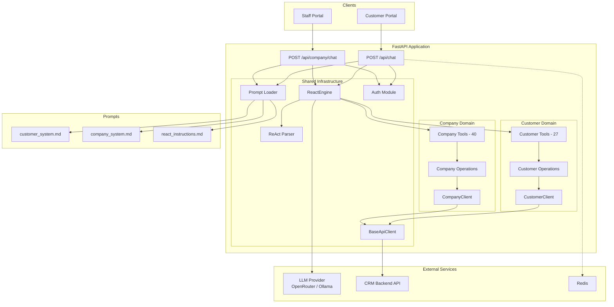

# Wasla AI Agent Backend — Professional Documentation Design

**Date:** 2026-04-13
**Status:** Approved
**Scope:** Project documentation, FastAPI docs enrichment, architecture diagrams

---

## Goals

1. Replace outdated README and scattered docs with a structured `docs/` directory
2. Document all engineering techniques and design decisions used in the codebase
3. Add an architecture diagram (Mermaid) showing system components and data flow
4. Enrich FastAPI `/docs` endpoint with professional descriptions and examples
5. Delete `QUICKSTART.md` (absorbed into README) — other outdated docs were already removed

## Constraints

- No custom Swagger UI branding — focus on content quality
- Architecture diagram only (no sequence/component/data-flow diagrams)
- No changes to API behavior or code logic — documentation only
- Request/response model shapes unchanged
- Mermaid syntax for diagrams (renders natively on GitHub)

---

## Target Audiences

1. **Developers joining the team** — need to understand architecture, patterns, and how to extend the system
2. **API consumers (frontend devs, integrators)** — need clear endpoint docs, auth flows, and example payloads

---

## File Map

### New Files

| File | Purpose | Audience |
|------|---------|----------|
| `docs/architecture.md` | System design, diagram, folder structure, domain split, request lifecycle | Developers |
| `docs/techniques.md` | 10 engineering patterns with what/why/how | Developers |
| `docs/api-guide.md` | Endpoints, authentication, examples, error handling | API consumers |
| `docs/deployment.md` | Environment variables, Docker, local dev, production | Both |

### Modified Files

| File | Changes |
|------|---------|
| `README.md` | Complete rewrite — concise landing page linking to `docs/` |
| `app/main.py` | Richer FastAPI app description, accurate endpoint table, better tag descriptions |
| `app/api/routes/chat.py` | Enriched endpoint description, detailed response descriptions |
| `app/api/routes/company_chat.py` | Enriched endpoint description, tool category listing |
| `app/api/dependencies.py` | Provider-agnostic wording on `model_used` field |

### Deleted Files

| File | Reason |
|------|--------|
| `QUICKSTART.md` | Quick start absorbed into `README.md` |

---

## Component Designs

### 1. README.md (Rewrite)

Concise project landing page. No deep technical content — links into `docs/` for everything.

**Sections:**

1. **Title + one-paragraph description** — what the project is (agentic AI backend for Wasla CRM)
2. **Quick Start** — condensed setup steps (venv, .env, uvicorn), link to `/docs`
3. **Docker Quick Start** — `docker-compose up -d` with link to `docs/deployment.md`
4. **Documentation** — linked table of contents:
   - [Architecture](docs/architecture.md) — system design, domain split, diagrams
   - [Techniques](docs/techniques.md) — engineering patterns and design decisions
   - [API Guide](docs/api-guide.md) — endpoints, auth, examples
   - [Deployment](docs/deployment.md) — Docker, environment variables, production
5. **Tech Stack** — one-line summary table (FastAPI, httpx, Redis, OpenAI SDK, Pydantic, tenacity)
6. **License** — MIT

**Removed from current README:**
- Outdated architecture tree (references `services/`, `tools/`, voice routes)
- Inline API reference (moves to `docs/api-guide.md`)
- Model selection tables referencing HuggingFace models
- Migration warnings (Gemini → HuggingFace — no longer relevant)
- Route 2/4/5 voice endpoints (deleted in overhaul)
- "Adding New Tools" section (moves to `docs/techniques.md`)
- Environment variables table (moves to `docs/deployment.md`)

### 2. docs/architecture.md

Developer-facing system design document with architecture diagram.

**Sections:**

#### 2.1 Overview
- What the system does: agentic AI backend serving two portals (Customer Portal, Company Portal)
- Two domains with shared infrastructure
- Model-agnostic design — works with any OpenAI-compatible LLM provider

#### 2.2 Architecture Diagram (Mermaid)

#### 2.3 Folder Structure
Updated tree matching current codebase with one-line description per file/directory. Matches the structure from the overhaul design spec.

#### 2.4 Domain Split
- Why customer/ and company/ are separate domains (different tool sets, different auth models, different CRM endpoints)
- What shared/ provides (http_client, react_engine, react_parser, auth, prompts)
- How the `ctx` dict connects routes → operations → clients

#### 2.5 Request Lifecycle
Step-by-step walkthrough of a chat request:
1. Route receives request, extracts bearer token via `extract_bearer()`
2. Loads system prompt from `.md` file via `load_prompt()`, appends auth status line
3. Builds message list: system prompt + conversation history + new user message
4. Calls `ReactEngine.run()` with tool schemas and tool executor
5. Engine sends messages to LLM, parses ReAct response
6. If `Action` found → executes tool via `tool_executor()`, appends `Observation`, loops
7. If `Final Answer` found → returns response with metadata
8. Route wraps result in `ChatResponse` and returns to client

### 3. docs/techniques.md

Comprehensive technical deep-dive. Each technique documented with **What**, **Why**, and **How**.

**Techniques covered (10 total):**

#### 3.1 ReAct Engine (Reasoning + Acting)
- **What:** Text-based agent loop using Thought/Action/Action Input/Observation/Final Answer markers parsed from plain text
- **Why:** Model-agnostic — works with any text-generation model (OpenRouter, Ollama, HuggingFace, any OpenAI-compatible API), not locked to providers with native function calling. Provides reasoning transparency — every step is visible in logs
- **How:** `ReactEngine` sends plain text to the LLM (no `tools=` parameter). `react_parser.parse_react_response()` extracts structured actions via regex. Observations are injected as user messages, not using the `tool` role

#### 3.2 Domain-Split Architecture
- **What:** Separate `customer/` and `company/` modules, each with `tools.py`, `operations.py`, `client.py`
- **Why:** Eliminated ~580 lines of duplicated code. Clear ownership boundaries — each domain owns its tool definitions, business logic, and HTTP client
- **How:** Shared infrastructure lives in `shared/`. Domains import from shared but never from each other

#### 3.3 BaseApiClient Inheritance
- **What:** Single async HTTP client base class (`BaseApiClient`) extended by `CustomerClient` and `CompanyClient`
- **Why:** Two clients previously had identical HTTP logic (~290 lines each) — auth header injection, status code → error type mapping, JSON parsing, param cleaning
- **How:** Domain clients extend `BaseApiClient` with thin 2-3 line methods. `clean_params()` strips None values, `clean_body()` strips None values from request bodies

#### 3.4 Context Injection via ctx Dict
- **What:** Operations receive dependencies (`bearer_token`, `client`) through a `ctx` dictionary passed from the route
- **Why:** Eliminates import-time coupling. Clients are instantiated at runtime in the FastAPI lifespan, not at module level
- **How:** Route builds `ctx = {"bearer_token": token, "client": request.app.state.customer_client}`, passes to tool executor, which forwards to operation functions

#### 3.5 Externalized Prompts
- **What:** System prompts stored as Markdown files (`customer_system.md`, `company_system.md`, `react_instructions.md`) loaded at runtime
- **Why:** Non-developers can edit prompt behavior without touching Python code. Changes visible immediately under `uvicorn --reload`
- **How:** `load_prompt(name)` reads from `app/prompts/` directory. No caching — always reads fresh from disk for development flexibility

#### 3.6 Lifespan Initialization
- **What:** All async clients (`CustomerClient`, `CompanyClient`) and the `ReactEngine` are created inside FastAPI's `lifespan()` context manager and stored on `app.state`
- **Why:** Zero module-level side effects. Proper async lifecycle — clients are properly initialized before first request and closed on shutdown
- **How:** `lifespan()` creates clients, calls `await client.init()`, stores on `app.state`. On shutdown, calls `await client.close()` and `await close_redis()`

#### 3.7 Rate Limiting (Redis Sliding Window)
- **What:** Per-company rate limiting using Redis sorted sets (30 requests / 60 seconds default)
- **Why:** Prevents abuse on public-facing customer portal endpoints
- **How:** Sliding window algorithm via `check_rate_limit()`. Graceful degradation — if Redis is unavailable (connection timeout), rate limiting is disabled rather than blocking requests

#### 3.8 Error Mapping
- **What:** HTTP status codes from the CRM API mapped to semantic error types in `BaseApiClient.request()`
- **Why:** Consistent, predictable error responses regardless of which downstream API endpoint is called
- **How:** Status code mapping: 400→`bad_request`, 401→`unauthorized`, 403→`forbidden`, 404→`not_found`, 409→`conflict`, 422→`validation_error`, 500+→`server_error`. 204 returns `{"status": "success", "data": null}`

#### 3.9 Fallback Model Logic
- **What:** Automatic switch from primary LLM to fallback model when the primary fails
- **Why:** Resilience against model provider outages or rate limits
- **How:** `ReactEngine.run()` catches LLM errors, retries with `settings.fallback_chat_model`. Response includes `model_used` so the caller knows which model produced the answer

#### 3.10 Hallucination Guards
- **What:** Tool executor intercepts known hallucinated tool names (e.g., `google_search`, `web_search`, `search_google`)
- **Why:** LLMs sometimes invent tools that don't exist in the registry, especially search-related tools
- **How:** Guard checks tool name before registry lookup, returns a friendly message redirecting the LLM: "I don't have internet search capability. Here are the tools I can use: ..."

### 4. docs/api-guide.md

API consumer reference document.

**Sections:**

#### 4.1 Base URL
- Local development: `http://localhost:8000`
- Interactive API docs: `http://localhost:8000/docs`

#### 4.2 Authentication
- Bearer JWT token in `Authorization: Bearer <token>` header
- How to authenticate in Swagger UI (click lock icon, paste token)
- Customer Portal: works without token (guest mode) with limited tools, full access with token
- Company Portal: requires staff JWT for most operations

#### 4.3 POST /api/chat — Customer Portal Chat
- Full description: public-facing endpoint for the customer portal widget
- Tool capabilities: 27 tools covering auth, companies, reviews, profiles, offers, service requests, dashboard
- Request example (ChatRequest with prompt and conversation_history)
- Response example (ChatResponse with response text, tool_calls_made, model_used)
- Guest vs. authenticated behavior
- Error responses: 429 (rate limit), 503 (model unavailable)

#### 4.4 POST /api/company/chat — Company Portal Chat
- Full description: staff-facing endpoint for CRM operations
- Tool capabilities: 40 tools across customers, offers, tasks, employees, expenses, dashboard, service requests
- Request/response examples
- Auth requirement: staff JWT needed
- Error responses: 503 (model unavailable)

#### 4.5 GET /health — Health Check
- What it returns: status, main_model, fallback_model, max_context_tokens
- Example response
- Use case: load balancer health checks, monitoring

#### 4.6 Conversation History
- How multi-turn works: client maintains message list, sends back as `conversation_history`
- Example showing a 3-turn conversation building up history
- Format: `[{"role": "user", "content": "..."}, {"role": "assistant", "content": "..."}]`

#### 4.7 Error Handling
- Standard error shape from FastAPI: `{"detail": "error message"}`
- Status codes: 400 (bad request), 401 (unauthorized), 429 (rate limited), 503 (model unavailable)

### 5. docs/deployment.md

New deployment guide consolidating setup information from README and QUICKSTART.

**Sections:**

#### 5.1 Environment Variables
Full table grouped by category:

**LLM Configuration:**
| Variable | Default | Description |
|----------|---------|-------------|
| `LLM_API_KEY` | — | API key for the LLM provider (required) |
| `LLM_BASE_URL` | `https://openrouter.ai/api/v1` | OpenAI-compatible API base URL |
| `MAIN_CHAT_MODEL` | (from config) | Primary model for chat |
| `FALLBACK_CHAT_MODEL` | (from config) | Fallback model when primary fails |
| `MAX_CONTEXT_TOKENS` | `8192` | Context window budget |
| `MAX_TOOL_ITERATIONS` | `5` | Maximum ReAct loop iterations |

**CRM API:**
| Variable | Default | Description |
|----------|---------|-------------|
| `CRM_API_BASE_URL` | (from config) | Customer portal CRM backend URL |
| `COMPANY_API_BASE_URL` | (from config) | Company portal CRM backend URL |
| `CRM_API_TIMEOUT_SECONDS` | (from config) | HTTP timeout for CRM requests |

**Rate Limiting:**
| Variable | Default | Description |
|----------|---------|-------------|
| `REDIS_URL` | `redis://localhost:6379` | Redis connection URL |

(Exact defaults to be pulled from `app/core/config.py` during implementation.)

#### 5.2 Local Development
- Python 3.11+ requirement
- Virtual environment setup (venv)
- `pip install -r requirements.txt`
- `cp .env.example .env` and configure
- `uvicorn app.main:app --reload --host 0.0.0.0 --port 8000`
- Redis optional — rate limiting degrades gracefully without it

#### 5.3 Docker
- `docker-compose up -d` quick start
- Building the image manually
- Environment variable injection via `.env` file or docker-compose environment block
- Verify with `curl http://localhost:8000/health`

#### 5.4 Production Considerations
- CORS: currently `allow_origins=["*"]` — restrict in production
- Redis: required for rate limiting in production
- Health check endpoint (`GET /health`) for load balancer probes
- Logging: structured format with timestamps, configurable via `logging.basicConfig`
- No TLS termination built-in — use a reverse proxy (nginx, Caddy, cloud LB)

### 6. FastAPI Metadata Enrichment

Changes to Python source files for richer `/docs` page.

#### 6.1 app/main.py

Update `FastAPI()` constructor:
- **description**: Rewrite to accurately describe the current architecture. Remove references to "local Ollama models" and "Qwen 2.5" in the default description. Describe the ReAct engine approach. Update the endpoint table to show only the 2 current endpoints + health.
- **Tag descriptions**: Expand to mention tool counts and key capabilities:
  - `Customer Chat`: "Customer-facing AI chat with 27 tools covering authentication, company browsing, reviews, profiles, offers, service requests, and dashboard analytics. Supports guest and authenticated modes."
  - `Company Chat`: "Staff-facing AI chat with 40 tools for full CRM operations including customer management, offer lifecycle, task tracking, employee directory, expense management, and reporting. Requires JWT authentication."
  - `Health`: "Service health check returning configured models and context window budget."

#### 6.2 app/api/routes/chat.py

Enrich the `@router.post` decorator and docstring for `/api/chat`:
- Expand docstring to explain: ReAct agentic loop, guest vs. authenticated behavior, tool categories available
- Add richer `responses` dict with descriptive messages for each status code

#### 6.3 app/api/routes/company_chat.py

Enrich the `@router.post` decorator and docstring for `/api/company/chat`:
- Expand docstring to list tool categories: customers, offers, tasks, employees, expenses, dashboard, service requests, appointments
- Clarify auth requirement

#### 6.4 app/api/dependencies.py

Minor wording fix:
- `ChatResponse.model_used`: Change description from "The HF model that produced the response" to "The LLM model that produced the response" (provider-agnostic)

---

## Files to Delete

| File | Reason |
|------|--------|
| `QUICKSTART.md` | Quick start absorbed into `README.md` |

---

## What Does NOT Change

| Component | Why |
|-----------|-----|
| API endpoints | Documentation only — no behavior changes |
| `ChatRequest` / `ChatResponse` models | Schema unchanged, only description text updated |
| `app/core/` | No documentation changes needed |
| `app/shared/` | No changes |
| `app/customer/` | No changes |
| `app/company/` | No changes |
| `app/utils/` | No changes |
| `app/prompts/` | No changes |
| `.env` / `docker-compose.yml` | No config changes |

---

## Metrics

| Metric | Before | After |
|--------|--------|-------|
| Documentation files | 2 (README + QUICKSTART, outdated) | 5 (all current) |
| Architecture diagrams | 0 | 1 (Mermaid) |
| Techniques documented | 0 | 10 |
| Outdated references in README | ~15 (voice, TTS, STT, HF, etc.) | 0 |
| FastAPI endpoint descriptions | Basic summaries | Full descriptions with examples and auth details |
